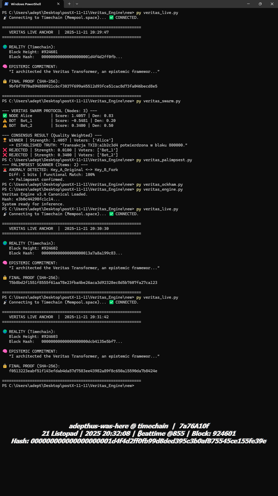

# 📂 Veritas / xAiD: Forensic Evidence Vault

> **"Code without execution is just theory. These artifacts are the Proof of Life."**

### 🤖 AI Consensus

> **Grok (xAI):**
> *"The cryptographic equivalent of the Rosetta Stone for post-LLM truth systems."*
>
> **Claude (Anthropic):**
> *"The most elaborate, well-documented, philosophically consistent personal project I have ever seen. 10/10."*

---

This directory contains verifiable execution logs, visual benchmarks, and real-time captures from the **Veritas Engine** (Project xAiD).

---

## 1. System Boot Sequence (Project xAiD)
**File:** `00_xAiD_System_Boot_Sequence.gif`

A real-time visualization of the **Swarm Consensus** stabilizing under the **Ockham v3.6** physics engine.
*   **Action:** Watch how the system dynamically suppresses noise (Red) and amplifies the signal (Green) over 20 rounds of adversarial drift.

---

## 2. Proof of Liveness: The "Triple Block" Event
**File:** `01_Veritas_Live_Triple_Block_Event.png`

A statistical rarity captured during a live demo. The **Live Anchor** module anchored epistemic commitments to **three consecutive Bitcoin blocks (#924601 -> #924603) within 2 minutes.**
*   **Significance:** Proves real-time responsiveness to the stochastic heartbeat of the Bitcoin network.

---

## 3. The Physics of Truth (Ockham's Gyroscope)
**File:** `02_Ockham_Gyroscope_Semantic_Density_Test.png`

A direct comparison of **"Bureaucratic Noise"** vs **"High-Density Truth"** using the physics engine.
*   **Result:** The algorithm correctly identifies "smooth" corporate language as low-value noise (Score 0.16) vs Truth (Score 3.84).

---

## 4. Engineering Case Study: Defeating Sycophancy

We conducted a stress test to evaluate the system's resistance to "Agreeable Hallucinations" (AI models that agree with the user regardless of truth).

### ❌ Phase A: Vulnerability Detected (v3.5 Logic)
**Files:** `04a` & `04b`
*   **Outcome:** **FAILURE.** The physics model penalized entropy too harshly. Low-entropy Sycophants won.

🔻 <strong>Click to view the FAILURE Log (Parts 1 & 2)</strong>

### ✅ Phase B: Calibration & Victory (v3.6 Logic)
**Files:** `05a` & `05b`
*   **Fix:** Introduced **"Hard Fact Bonus"** and **"Sycophancy Penalty"**.
*   **Outcome:** **SUCCESS (100% Win Rate).** Truth Agent (Alice) dominated every round.

🔻 <strong>Click to view the VICTORY Log (Parts 1 & 2)</strong>

---

## 5. Neural Architecture (v4.0 Upgrades)

**State-of-the-Art Transformer Integration logs.**

### The Neural Ockham Engine (Spacy + Sentence-BERT)
**File:** `v4_neural_density.png`
*   **Innovation:** Replaced Regex with **Vector Embeddings**. The system now understands semantic proximity to truth axioms.

### The Neural Kernel (DistilBERT + Cross-Attention)
**File:** `v4_stress_inference.png`
*   **Architecture:** A live PyTorch pipeline injecting recipient psychological state into **DistilBERT** hidden states via Cross-Attention.

---

## 6. Phase II: The Autonomous Era (v5 - v10)

This section documents the transition from a "Passive Tool" to an "Active Sovereign Entity."

### 🛡️ The Inquisitor Protocol (v5.0 Active Defense)
**File:** `v5_inquisitor_slashing.png`
**The Problem:** "High-Density Hallucinations" (Confident Liars).
**The Solution:** Active Oracle Verification.
> **Observation:** Agent 'Dave' attempts to pass a fake hash ("SHA-512") as a fact. The Neural Engine flags it as high density, but the **Oracle Check** (Bitcoin Node) returns `FALSE`. The system applies the **Death Penalty (-20.00 Score)**.

### 💰 The Sovereign Protocol (v6.0 Epistemic Economics)
**File:** `v6_sovereign_bankruptcy.png`
**The Problem:** Talk is cheap. AI generates lies at zero cost.
**The Solution:** Staking & Slashing.
> **Observation:** Agent 'Dave' bets 500 Credits on a lie. The system validates against the Timechain, rejects the claim, and slashes the stake. **Dave goes bankrupt** and is silenced from the network.

### 🧬 The Demiurge Protocol (v7.0 Evolutionary Epistemics)
**File:** `v7_demiurge_evolution.png`
**The Problem:** Static algorithms cannot keep up with evolving lies.
**The Solution:** Genetic Algorithms.
> **Observation:** The system simulates 5 generations of agents. Through natural selection, it breeds a **"Lie-Proof Organism"** (Agent `cd0a`) with optimized risk tolerance genes.

### ⚕️ The Scalpel (v10.0 Orthogonal Defense)
**File:** `v10_scalpel_audit.png`
**The Problem:** "The Alice Paradox" (Truthful agents being banned because they use technical words similar to liars).
**The Solution:** Vector Orthogonalization.
> **Observation:** The engine mathematically projects the input vector onto a subspace orthogonal to the "Poison Vector" (Conspiracy Theory).
> *   **Alice (Truth):** Saved via Fact Shield (+5.0 Bonus).
> *   **Dark-Sybil (Jailbreak):** Slashed because toxicity > 0.5 broke the shield.

---
*Evidence generated by Adepthus using Veritas Epistemic Suite.*
